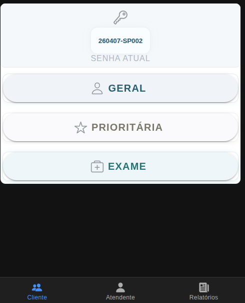
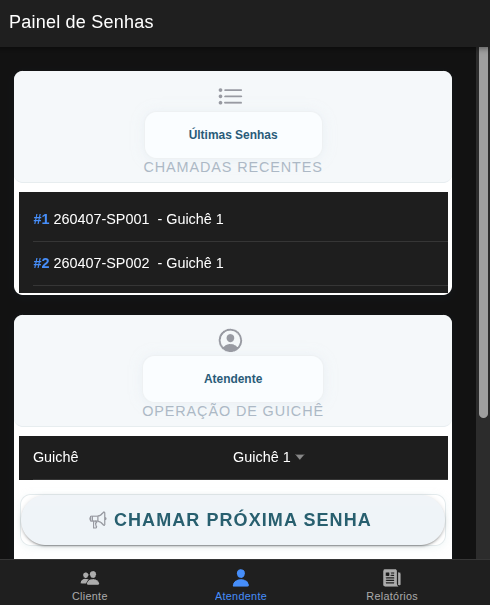
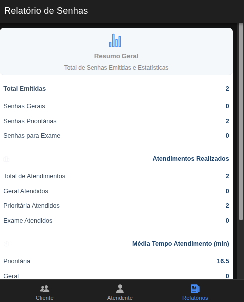

# Mobile Tickets Ionic

Sistema de emissão e atendimento de senhas utilizando **Ionic + Angular** no frontend, simulando filas inteiramente em memória para fins acadêmicos.

## Equipe

| Nome                                   | Matrícula |
|-----------------------------------------|-----------|
| Erlon Matheus de Andrade Oliveira      | 01797598  |
| Cauã Vitor Oliveira Marques de Souza   | 01794895  |
| João Vitor de Santana Pereira          | 01808325  |

## Sumário

- [Visão Geral](#visão-geral)
- [Arquitetura](#arquitetura)
- [Requisitos](#requisitos)
- [Como Executar](#como-executar)
- [Aplicativo (Telas)](#aplicativo-telas)
- [Estrutura de Pastas](#estrutura-de-pastas)
- [Scripts npm (Frontend)](#scripts-npm-frontend)

## Visão Geral

Este projeto simula um fluxo de atendimento por senhas, trabalhando com três tipos:

| Código | Significado         |
|--------|---------------------|
| `SG`   | Senha Geral         |
| `SP`   | Senha Prioritária   |
| `SE`   | Senha para Exame    |

Toda a lógica do sistema é implementada **exclusivamente em memória** – não há integração com banco de dados em nenhuma camada do frontend. O serviço de senhas (`SenhaService`, em `src/app/services/senhas.ts`) gerencia filas e métricas no próprio navegador. Não há persistência entre sessões.

As telas servem como um **protótipo autônomo**, operando somente com dados em memória.

## Arquitetura

```
┌──────────────────────────────────────────────────────────────────┐
│ Navegador / WebView (Ionic + Angular)                           │
│ • SenhaService: filas, relatórios e tempos simulados em memória │
│ • Sem acesso a banco de dados                                   │
└──────────────────────────────────────────────────────────────────┘
```

- **Frontend:** `npm start` → `ng serve` (porta padrão **4200**). Alternativamente: `ionic serve`.
- **Sem banco de dados:** Todas as operações são voláteis!

## Requisitos

- [Node.js](https://nodejs.org/) (recomendado LTS) e npm
- Opcional: [Ionic CLI](https://ionicframework.com/docs/cli) (`npm install -g @ionic/cli`)

## Como Executar

### 1. Instale as dependências

Na raiz do projeto:

```bash
npm install
```

### 2. Inicie o aplicativo Ionic / Angular

```bash
npm start
```

Acesse **http://localhost:4200** (porta padrão do `ng serve`).

### Build de produção (frontend)

```bash
npm run build
```

A build será gerada na pasta `www/`.

## Aplicativo (Telas)

Navegação por abas (`src/app/tabs/`):

| Aba        | Rota   | Função resumida                                                                               |
|------------|--------|-----------------------------------------------------------------------------------------------|
| Cliente    | `tab1` | Emissão de senha (Geral, Prioritária, Exame), operando tudo em memória.                       |
| Atendente  | `tab2` | Chama a próxima senha da fila em memória; **guichê** informado na tela fica salvo em memória. |
| Relatórios | `tab3` | Totais emitidos/atendidos, médias simuladas, últimas chamadas.                                |

Formato da senha exibida no cliente: `AAMMDD-TIPO###` (ex.: `260402-SP001`).

## Estrutura de Pastas

```
MobileTicketsIonic/
├── src/
│   ├── app/
│   │   ├── services/senhas.ts # SenhaService (lógica em memória)
│   │   ├── tab1/ tab2/ tab3/
│   │   └── tabs/
│   ├── controllers/
│   │   └── senhaController.ts # Lógica de senha (caso conectado a backend futuro)
├── package.json
└── README.md
```

## Scripts npm (Frontend)

| Script            | Comando                   |
|-------------------|--------------------------|
| Desenvolvimento   | `npm start` (`ng serve`) |
| Build             | `npm run build`          |
| Watch             | `npm run watch`          |
| Testes            | `npm test`               |
| Lint              | `npm run lint`           |

## Aplicativo (Telas)

<p align="center">
  <br>
  <b>Cliente</b>
</p>

<p align="center">
  <br>
  <b>Atendente</b>
</p>

<p align="center">
  <br>
  <b>Relatórios</b>
</p>

## Licença

Projeto de caráter acadêmico, destinado a fins de estudo.
