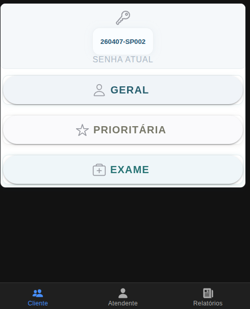
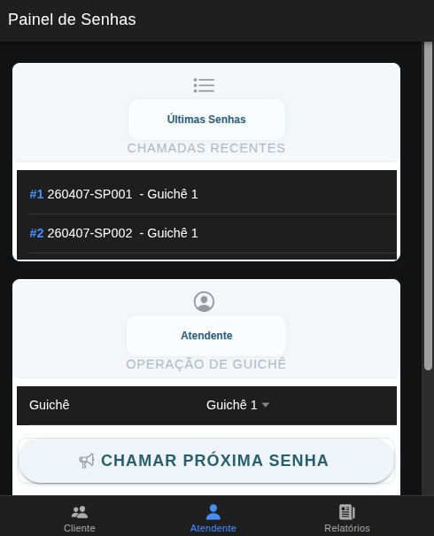
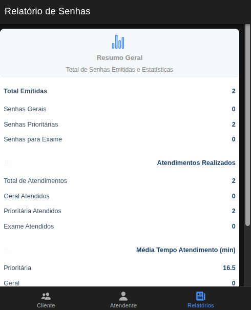

# MobileTicketsIonic

Aplicativo Ionic para controle de atendimento por senhas em filas de laboratório médico. O projeto foi desenvolvido com **Ionic + Angular**, template **tabs**, estrutura **Angular com ngModules** e integração **Capacitor**.

## Equipe

| Nome | Matrícula |
|---|---|
| Erlon Matheus de Andrade Oliveira | 01797598 |
| Cauã Vitor Oliveira Marques de Souza | 01794895 |
| João Vitor de Santana Pereira | 01808325 |

## Objetivo

Simular o fluxo de emissão, chamada e relatório de senhas do sistema de atendimento descrito na Fase 2 do projeto mobile. O app funciona em memória, sem banco de dados, permitindo demonstrar as regras de prioridade e os relatórios solicitados.

## Regras Implementadas

- Três tipos de senha: `SP` prioritária, `SE` exame e `SG` geral.
- Numeração no formato `YYMMDD-PPSQ`, com sequência reiniciada por tipo a cada novo expediente.
- Atendimento alternado conforme a regra `[SP] -> [SE|SG] -> [SP] -> [SE|SG]`.
- Expediente diário das 07:00 às 17:00, com descarte das senhas restantes ao encerrar.
- Descarte sem atendimento para 5% das senhas emitidas, representando cliente ausente.
- Painel com as 5 últimas senhas chamadas, sem exibir senha futura.
- Tempo médio simulado por tipo: `SP` entre 10 e 20 min, `SG` entre 2 e 8 min, `SE` com 95% em 1 min e 5% em 5 min.
- Relatórios diário e mensal com totais emitidos, atendidos, descartados, dados por tipo, tempos médios e relatório detalhado.

## Telas

### Cliente

Emite senhas para atendimento geral, prioritário ou retirada de exames.

<p align="center">
  
</p>

### Atendente

Permite selecionar o guichê, chamar a próxima senha seguindo a regra de prioridade, encerrar expediente e iniciar novo expediente.

<p align="center">
  
</p>

### Relatórios

Exibe os indicadores diário e mensal, a lista detalhada das senhas e as últimas chamadas do painel.

<p align="center">
  
</p>

## Tecnologias

- Ionic Framework
- Angular com ngModules
- Capacitor
- TypeScript
- Ionicons

## Como Executar

Instale as dependências:

```bash
npm install
```

Execute o app em modo desenvolvimento:

```bash
npm start
```

Acesse `http://localhost:4200` no navegador.

## Build

```bash
npm run build
```

A saída de produção será gerada em `www/`, diretório usado pelo Capacitor.

## Estrutura

```text
MobileTicketsIonic/
├── capacitor.config.ts
├── src/
│   ├── app/
│   │   ├── services/senhas.ts
│   │   ├── tab1/
│   │   ├── tab2/
│   │   ├── tab3/
│   │   └── tabs/
│   └── assets/
├── LICENSE
├── README.md
└── package.json
```

## Scripts

| Script | Comando | Descrição |
|---|---|---|
| `start` | `ng serve` | Executa o app localmente |
| `build` | `ng build` | Gera a build em `www/` |
| `watch` | `ng build --watch --configuration development` | Build em modo observação |
| `test` | `ng test` | Executa os testes Angular |
| `lint` | `ng lint` | Executa o lint configurado |

## Licença

Este projeto está licenciado sob a licença MIT. Consulte o arquivo [LICENSE](./LICENSE).
